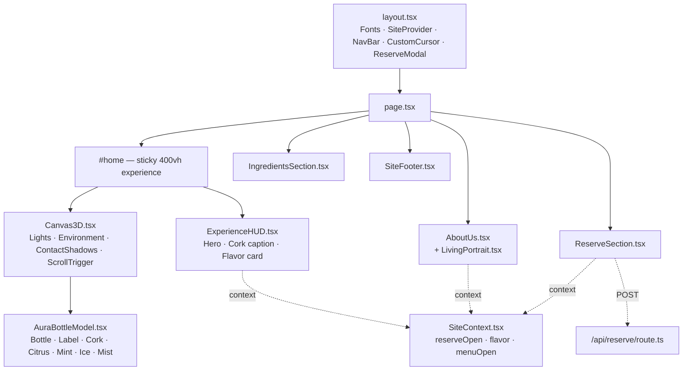

<div align="center">

<!-- Animated wave banner -->


<!-- Animated typing tagline -->
<a href="#">
  
</a>

<br/>

<!-- Badge stack -->
[](https://nextjs.org/)
[](https://react.dev/)
[](https://threejs.org/)
[](https://www.typescriptlang.org/)
[](https://tailwindcss.com/)
[](https://gsap.com/)
[](https://www.framer.com/motion/)
[](https://vercel.com/)

[](../../stargazers)
[](../../issues)
[](#-license)
[](#-contributing)

</div>

<br/>

<div align="center">
  
</div>

<br/>

<p align="center">
  <em>An ultra-luxury, minimal 3D scroll-driven product site — a frosted-glass tonic bottle rendered with physically-based transmission materials, uncorked and orbited by real-time botanicals as you scroll.</em>
</p>

<div align="center">
  <sub>Inspired by the restraint of Kin Euphorics & Ghia — built entirely in code, no external 3D assets.</sub>
</div>

---

## 📖 Table of Contents

<details>
<summary><b>Click to expand</b></summary>

- [🎬 Overview](#-overview)
- [✨ Features](#-features)
- [🧬 Tech Stack](#-tech-stack)
- [🗺️ Architecture](#️-architecture)
- [🎞️ The Scroll Choreography](#️-the-scroll-choreography)
- [📂 Project Structure](#-project-structure)
- [🚀 Getting Started](#-getting-started)
- [☁️ Deploy to Vercel](#️-deploy-to-vercel)
- [🔐 Environment Variables](#-environment-variables)
- [🧪 Roadmap](#-roadmap)
- [🤝 Contributing](#-contributing)
- [📜 License](#-license)

</details>

---

## 🎬 Overview

> Scroll. The bottle breathes, rotates, and catches studio light through
> real transmission-based frosted glass. Scroll further — the cork
> twists free, a whisper of mist escapes, and the camera pushes into a
> macro close-up. Scroll to the end — citrus, mint, and ice break
> orbit around the bottle like a zero-gravity botanical constellation.

<div align="center">

| Frame 1 — Hero | Frame 2 — Uncorking | Frame 3 — Orbit |
|:---:|:---:|:---:|
| Ambient float + rotation | Cork pop + mist burst + macro push-in | Botanicals expand into orbit |
| `0% → 35%` scroll | `35% → 65%` scroll | `70% → 100%` scroll |

</div>

---

## ✨ Features

<table>
<tr>
<td width="50%" valign="top">

**🍾 Physically-Based 3D Bottle**
Real `meshPhysicalMaterial` transmission, IOR, roughness & clearcoat — not a fake glass shader.

**🌿 Procedural Botanicals**
Citrus slices, mint leaves, and ice cubes — all generated meshes, zero imported 3D models.

**🎞️ GSAP ScrollTrigger Timeline**
A single scrubbed timeline drives bottle rotation, cork pop, camera orbit, and botanical expansion in perfect lockstep.

**💧 Mist Particle System**
A neck-emitted points system bursts on uncork and settles into ambient drift.

</td>
<td width="50%" valign="top">

**🪟 Glassmorphic HUD**
Framer Motion–driven fluid typography, scroll-scoped opacity/position transforms.

**🖱️ Custom Smooth Cursor**
Spring-eased dot + trailing ring, desktop only.

**🖼️ Animated "Living Portrait"**
Founder photo with breathing scale, rotating gold halo, light sheen, and cursor-parallax tilt.

**📬 Working Reserve Flow**
Email capture posts to a real `/api/reserve` route — modal *and* inline section, both wired.

</td>
</tr>
</table>

---

## 🧬 Tech Stack

<div align="center">

| Layer | Technology | Why |
|---|---|---|
| Framework |  | App Router, `next/font`, API routes, zero-config Vercel deploys |
| Language |  | Fully typed 3D refs, props, and API payloads |
| 3D Engine |   | Declarative scene graph, `drei` helpers (`Environment`, `ContactShadows`, `Sparkles`, `RoundedBox`) |
| Motion (3D) |  | Scrub-synced timeline for mesh + camera choreography |
| Motion (UI) |  | `useScroll`, `useSpring`, `useTransform` for HUD + portrait |
| Styling |  | Utility-first, custom `aura` palette + `Fraunces`/`Inter` type scale |
| Icons |  | Consistent, tree-shakeable line icons |
| Hosting |  | Zero-config deploy target |

</div>

---

## 🗺️ Architecture



---

## 🎞️ The Scroll Choreography

<div align="center">

```
0% ─────────────── 35% ─────────────── 65% ─────────────── 100%
│                    │                   │                    │
│   AMBIENT HERO      │   CORK POP +      │   MACRO PUSH-IN     │  FLAVOR ORBIT
│   float + rotate    │   MIST BURST      │   camera → neck      │  citrus·mint·ice
│                    │                   │                    │  expand outward
└────────────────────┴───────────────────┴────────────────────┘
        GSAP ScrollTrigger (scrub) ── in lockstep ── Framer Motion useScroll
```

</div>

---

## 📂 Project Structure

```
aura-sip-project/
├─ src/
│  ├─ app/
│  │  ├─ layout.tsx              # Fonts, providers, global chrome
│  │  ├─ page.tsx                 # Composes the pinned experience + sections
│  │  ├─ globals.css              # Scrollbar, glass, cursor, type styles
│  │  └─ api/reserve/route.ts     # Email-capture endpoint
│  └─ components/
│     ├─ AuraBottleModel.tsx      # 🍾 All 3D meshes
│     ├─ Canvas3D.tsx             # 🎥 Scene, lights, ScrollTrigger timeline
│     ├─ ExperienceHUD.tsx        # 🪟 Scroll-scoped hero/cork/flavor UI
│     ├─ NavBar.tsx               # 🧭 Fixed nav + mobile menu
│     ├─ ReserveModal.tsx         # 📬 Global pre-order modal
│     ├─ ReserveSection.tsx       # 📬 Inline reserve section
│     ├─ AboutUs.tsx              # 📖 Brand story
│     ├─ LivingPortrait.tsx       # 🖼️ Animated founder portrait
│     ├─ IngredientsSection.tsx   # 🌿 Botanical grid
│     ├─ SiteFooter.tsx           # 🔗 Contact + socials
│     ├─ SiteContext.tsx          # 🔄 Shared app state
│     └─ CustomCursor.tsx         # 🖱️ Smooth custom cursor
├─ public/images/founder.jpg
├─ create_zip.py
└─ package.json
```

---

## 🚀 Getting Started

```bash
# 1. Install dependencies (versions pinned — no peer-dep conflicts)
npm install

# 2. Run the dev server
npm run dev

# 3. Open the ritual
open http://localhost:3000
```

<div align="center">

| Command | Purpose |
|---|---|
| `npm run dev` | Local development with hot reload |
| `npm run build` | Production build |
| `npm run start` | Run the production build locally |
| `npm run lint` | Lint the codebase |
| `python3 create_zip.py` | Repackage the whole project into a `.zip` |

</div>

---

## ☁️ Deploy to Vercel

[](https://vercel.com/new)

1. Push this repo to GitHub.
2. Import it in Vercel — Next.js is auto-detected, no config needed.
3. Ship it. `/api/reserve` works out of the box with zero env vars.

---

## 🔐 Environment Variables

None are required to run or deploy. To send **real** confirmation
emails from `/api/reserve`, add a provider key:

```bash
# .env.local
RESEND_API_KEY=your_key_here
```

(See the commented example inside `src/app/api/reserve/route.ts`.)

---

## 🧪 Roadmap

- [x] Physically-based frosted glass bottle
- [x] GSAP-driven cork pop + mist burst
- [x] Procedural citrus / mint / ice botanicals
- [x] Glassmorphic HUD + fluid typography
- [x] Animated founder "living portrait"
- [x] Working reserve flow (modal + inline + API route)
- [ ] Real ESP integration (Resend / Mailchimp) wired to `/api/reserve`
- [ ] Multi-flavor bottle re-texturing on selection
- [ ] Sound design synced to the cork-pop moment
- [ ] i18n (multi-language HUD copy)

---

## 🤝 Contributing

Contributions, issues, and feature requests are welcome.

```bash
git checkout -b feature/your-idea
git commit -m "feat: your idea"
git push origin feature/your-idea
```

Then open a PR — please keep 3D changes performance-conscious (mobile
GPUs will thank you).

---

## 📜 License

Distributed under the **MIT License**. Do what you want, just keep
the ritual intact.

<div align="center">


**AURA-SIP** · *A ritual, bottled.* 🍾

</div>
